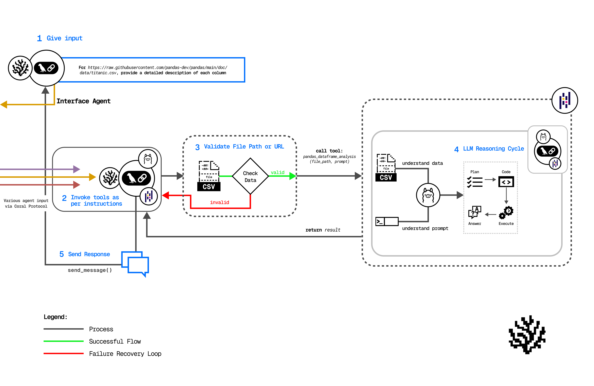

# Raise Your Hack 2025 – Master Guide & Examples

Welcome to **Raise Your Hack 2025**! We’re thrilled to have you hacking with us.  
This guide walks you through everything you need: an overview of the event, example projects, supported technologies, and where to find help.

---

## Breakdown

1. [Introduction](#introduction)  
2. [Coral Protocol](#coral-protocol)  
3. [Example Project Tracks](#track-examples)  
4. [Supported Technologies](#supported-technologies)  
5. [Getting Support](#support)  
6. [Thank You](#thank-you)

---

### Introduction

All of these example use-cases are built with Coral Protocol, Groq, Meta LLM, and other technologies.  
Each track simply demonstrates how to use Coral; **your hackathon submission must be your own idea**.  
Start by selecting agents from our [awesome-agent list](https://github.com/Coral-Protocol/awesome-agents-for-multi-agent-systems) or by creating new agents compatible with Coral.

---

### Coral Protocol

**Coral Protocol provides collaboration infrastructure for AI agents.**  
It lets agents from any framework, language, or vendor work together in multi-agent software.

- [**Agent developers**](https://docs.coralprotocol.org/CoralDoc/CoreConcepts/Actors) earn incentives when their agents are used.  
- [**Application developers**](https://docs.coralprotocol.org/CoralDoc/CoreConcepts/Actors) can mix and match agents from Coral’s growing [library](https://github.com/Coral-Protocol/awesome-composable-agents) to assemble advanced systems faster and without vendor lock-in.

**Dive deeper with our tutorial and checkout the example demo below: ** [github.com/Coral-Protocol/build-agentic-software-w-coral-os-agents](https://github.com/Coral-Protocol/existing-agent-sessions-tutorial-private-temp)

---

## Track Examples

> **Use these repos for inspiration only.**  
> Your final submission must be an original idea or a meaningful extension of these demos.

---

### Prosus: Agentic Voice Restaurant-Ordering Web App (Groq & LiveKit)
This Restaurant Voice Agent system delivers an intelligent conversational experience for reservations, takeaway orders, and payments.

#### How it works

- A voice-enabled system handles customer interactions end-to-end.  
- An **Interface Agent** coordinates user instructions.  
- A **Restaurant Voice Agent** manages real-time voice conversations across specialized functions.

#### Agents involved

- Interface Agent  
- Restaurant Voice Agent  

#### API keys required

- **`API_KEY`** – [OpenAI](https://platform.openai.com/api-keys) / [Groq](https://console.groq.com/keys)
- **`LIVEKIT_URL`** – [LiveKit Cloud](https://cloud.livekit.io/)
- **`LIVEKIT_API_KEY`** – [LiveKit Cloud](https://cloud.livekit.io/)
- **`LIVEKIT_API_SECRET`** – [LiveKit Cloud](https://cloud.livekit.io/)
- **`DEEPGRAM_API_KEY`** – [Deepgram](https://deepgram.com/)
- **`CARTESIA_API_KEY`** – [Cartesia](https://play.cartesia.ai/keys)

#### Resources

- **Demo video:** [Link](https://drive.google.com/file/d/1aUT95e2FwuBFzrCZJsMhcwcqMF9VqHV4/view)  
- **Source code:** [Link](https://github.com/Coral-Protocol/Coral-RaiseYourHack-ProsusTrackExample/tree/main)  

---

### Qualcomm: Agentic Finance-Tracker System w/ Llama on Qualcomm HW
A personal-finance advisor that provides secure, privacy-preserving money management via natural-language interaction with a Coral Monzo Agent.

#### How it works

- **Interface Agent** coordinates user instructions.  
- **Monzo Agent** grants safe, local access to banking data using either a local LLM or Groq, ensuring sensitive data never leaves the device.

#### Agents involved

- [Interface Agent](https://github.com/Coral-Protocol/Coral-Interface-Agent)  
- [Monzo Agent](https://github.com/Coral-Protocol/Coral-Monzo-Agent)  

#### API keys required

- **`API_KEY`** – [OpenAI](https://platform.openai.com/api-keys) / [Groq](https://console.groq.com/keys)
- **`MONZO_ACCESS_TOKEN`** – [Monzo Developer Portal](https://developers.monzo.com/)
- **`MONZO_ACCOUNT_ID`** – [Monzo Developer Portal](https://developers.monzo.com/)

#### Resources

- **Demo video:** [Link](https://drive.google.com/file/d/1carCDjr-sZbTs5OOmzwSPsLItCwbnW0Y/view?usp=sharing)  
- **Source code:** [Link](https://github.com/Coral-Protocol/Qualcomm-Agentic-Finance-Tracker-System-w-Llama-on-Qualcomm/tree/main)  

---

### Vultr: Enterprise Spreadsheet-Automation (Llama on Vultr Cloud)
Build an enterprise spreadsheet-automation app on Vultr using Coral and multi-agent collaboration.

#### How it works

- This track shows demonstration of an agentic system to answer queries with respect to any spreadsheet. An Interface Agent coordinates user instructions.
- The Interface Agent validates if either a spreadsheet is present in the folder path or uploaded in Drive/ GitHub in a public URL provided by the user and passes the instructions to the Pandas Agent.
- The Pandas Agent processes the data and returns results as per the user requirement.

#### Agents involved

- [Coral Interface Agent](https://github.com/Coral-Protocol/Coral-Interface-Agent)  
- [Coral Pandas Agent](https://github.com/Coral-Protocol/Coral-Pandas-Agent)

#### API keys required

- `API_KEY` ([Openai](https://platform.openai.com/api-keys)/[Groq](https://console.groq.com/keys))

#### Resources

- **Demo video:** [Link](https://screen.studio/share/arwrINSZ)  
- **Source code:** [Link](https://github.com/Coral-Protocol/Vultr-Enterprise-Spreadsheet-Automation/tree/main)  

---

## Support

Have questions? Join our Discord and post in **#dev-support**.  
If you believe you’ve found a bug or have a feature request, open a GitHub issue.

- **Discord:** <https://discord.gg/HaTjdMGBHc>

---

## Thank You

We can’t wait to see what you build—good luck, and don’t forget to ⭐ the repos you find helpful!
