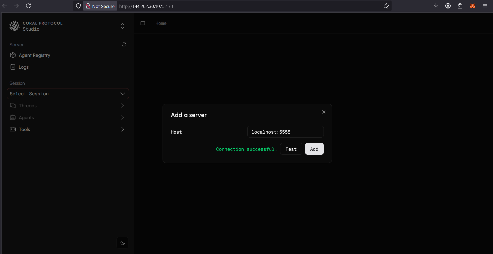
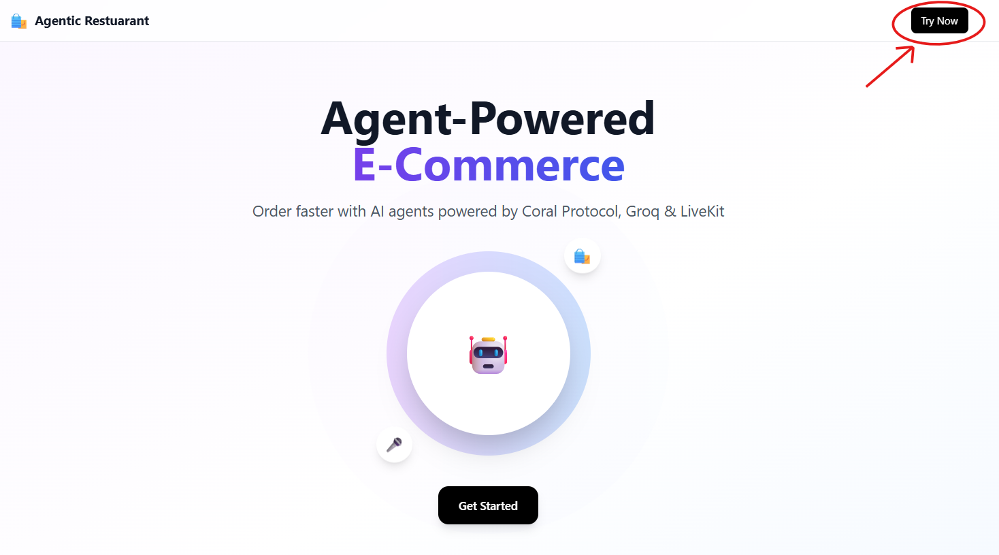
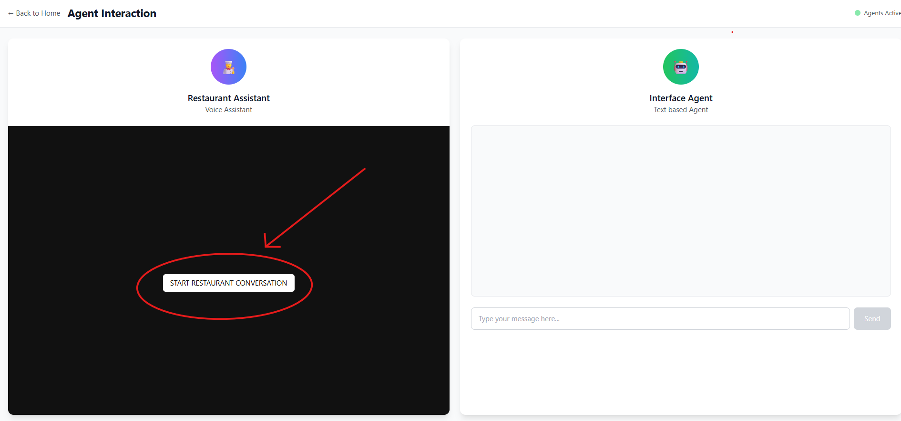
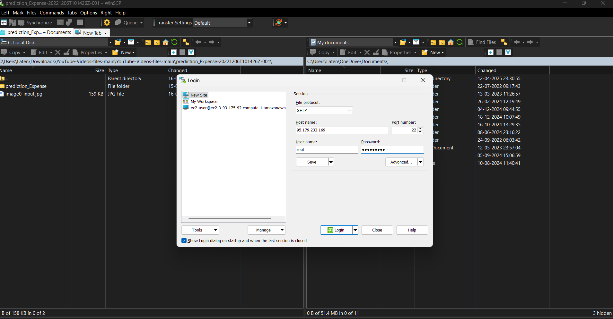
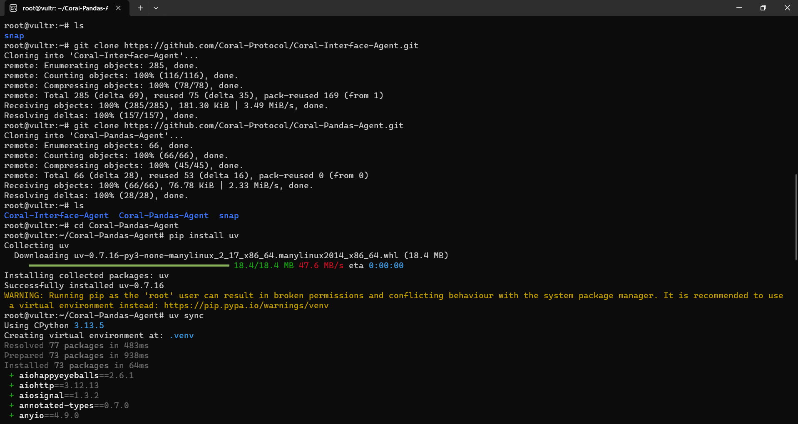
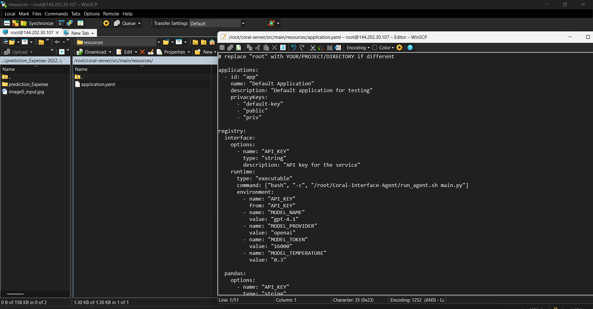
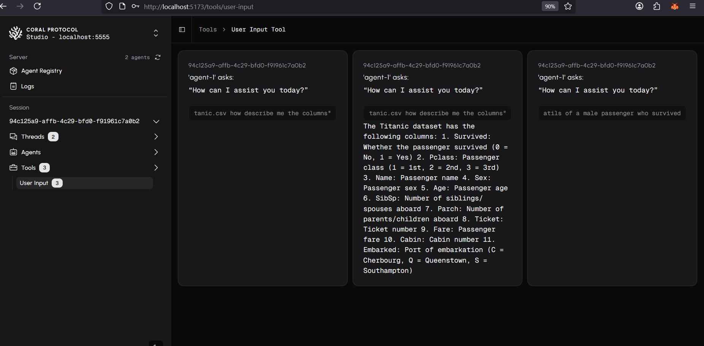

# Coral Raise Your Hack Guide

## About Raise Your Hack 💻
This is your chance to push boundaries, solve real-world challenges, and create impact at the official hackathon of the [RAISE Summit 2025](https://www.raisesummit.com/) at one of Paris's most iconic venues: Le Carrousel du Louvre. RAISE Summit 2025 is a premier event convening the brightest minds across industries to accelerate innovation and drive the future of entrepreneurship, AI, and technology.

## About Coral Protocol 🪸

The [Coral Protocol](https://www.coralprotocol.org/) is an initiative to create an open, standardized infrastructure for AI agent coordination. It builds on the MCP framework to enable multiple AI agents to work together collaboratively, addressing the limitation of isolated AI systems that lack mechanisms for interconnected workflows. The Coral Protocol focuses on:

- Agent Collaboration: Allowing AI agents to communicate, share tasks, and coordinate in a structured way.

- Messaging Layer: Providing a system for agents to exchange messages, similar to human messaging platforms, with features like threads and mentions.

- Scalability and Openness: Designing an extensible, open-source solution that can support a wide range of AI applications, from customer support to project management.

We released the [Coral Server](https://github.com/Coral-Protocol/coral-server) as an open-source MCP server to serve as the backbone for this vision. The server acts as a messaging hub where AI agents can register, communicate via threads, and coordinate tasks by mentioning each other. The protocol aims to foster a community-driven ecosystem, encouraging developers to experiment, contribute, and build collaborative AI systems.

## About the Tracks 🎯

Coral Protocol is encouraged for teams interested in multi-agent systems, allowing them to integrate open-source agents from any framework. With its thread-based agent architecture, Coral enables scalable and predictable multi-agent interactions, making it a powerful tool for innovative applications. Build on one of the below tracks using Coral Protocol.

### Qualcomm Track

🧠 Edge AI Consumer Utility Application

<details>

Build a powerful, AI-driven utility app for everyday users—right at the edge.
In this track, you'll will develop a consumer-facing utility application that runs entirely on-device using the Snapdragon X Elite platform. The challenge is to harness the power of Edge AI to create a tool that is both useful and accessible to a broad audience—without relying on cloud connectivity.

🔍 What We’re Looking For:

• Consumer-Oriented: The app should appeal to a wide range of users and offer clear, everyday value.
• Utility-Focused: It must help users accomplish a task—whether it's organizing, creating, assisting, or enhancing their experience.
• Edge AI-Powered: The core functionality should include a probabilistic AI component (e.g., computer vision, audio processing, or generative AI) that runs locally in a resource-constrained environment.
• Cross-Platform: While the app targets Snapdragon X Elite, it should be compatible with Windows, macOS, and Linux.
• Developer-Ready: Submissions should include a GitHub repository with setup and run instructions. A polished consumer UI is not required—focus on functionality and innovation.

🛠️ Tech Flexibility:

• Use any programming language or framework.
• Combine multiple AI modalities (CV, audio, Gen AI) as needed.
• No internet connection should be required for core functionality.

Qualcomm will directly ship the Copilot+ PC with the Snapdragon® X Elite (loaner devices) to selected participants and collect them at the conclusion of the hackathon.

The hardware will be shipped on June 30th with next-day delivery.

</details>

### Prosus Track

🤖 Design an Agent-Powered E-Commerce App

<details>

Create an e-commerce application that uses AI agents to let users perform one or more of the following tasks:

•  Food ordering: Restaurant discovery, menu browsing, order placement
•  Travel Booking: Flight searches, hotel reservations, itinerary planning
•  Product Marketplace: New and second-hand item purchases

Your app should build a reusable user profile based on in-app conversations. This profile will help personalize experiences across different activities and should be stored as a knowledge graph.

Bonus Challenges:
•  Build a voice-first user interface
•  Support multimodal input for richer user interactions
•  Store the user profile as a knowledge graph

To Succeed in This Challenge:
• Focus on core functionality – show live, working features (live demo, not just slides!)
• Use pre-trained models and APIs to save time
• Keep your code modular and simple for easier debugging

Judges Will Focus On:
• Technical Execution – Does the MVP work reliably?
• AI Integration – How creatively and effectively is AI used?
• Originality & Impact – How novel is the idea, and does it solve a real-world problem?
• Agentic Capabilities – How useful, stable, and advanced are the agent-powered features?

⚠️ We encourage participants to explore a variety of technologies for this challenge, including: 
• SERP API
• Tavily
• Twilio
All of which offer free tiers for testing.

</details>

### Vultr Track

🧠 Agentic Workflows for the Future of Work

<details>

Build a Web-Based Enterprise Agent Deployed on Vultr

In this track, you'll design and develop a web-based AI agent purpose-built to support enterprise teams—from marketing to sales, operations, and beyond. Your mission: create a smart, agentic tool that simplifies, accelerates, or transforms workflows for today’s (and tomorrow’s) knowledge workers. The core app should be deployed on Vultr infrastructure and optimized for real-world business use cases.

🔍 What We’re Looking For:
• Enterprise-Ready: Your agent should address pain points or opportunities within marketing, sales, customer success, HR, or other enterprise functions.

• Agentic & Autonomous: Move beyond simple prompts. Build workflows where the agent can reason, plan, and act with minimal human input. Think multi-step tasks, decision trees, and feedback loops.

• Future-of-Work Focused: Help teams save time, make smarter decisions, or enhance collaboration—through the lens of what future employee experience could look like.

• Web-Based & Deployed on Vultr: The app must be a deployable web app running on Vultr. You can use any stack, language, or framework, but it should be cloud-hosted and publicly accessible (Vultr credits will be provided).

• Scalable Tooling: We encourage—but don’t require—use of technologies like vector databases, model context protocol (MCP), or other modular, scalable AI components.

🛠️ Tech Flexibility:
• Use any programming language or framework.
• Use open-source LLMs, retrieval-augmented generation. (Also available via Vultr Serverless Inference)

📦 Developer Expectations:
• Include a GitHub repo with setup instructions, agent capabilities, and a sample use case demo.
• Deploy on Vultr (we’ll provide credits and assistance).
• Show how your app solves a real problem in an enterprise context.

Each team leader of the Vultr Track will receive a coupon code to claim $250 in free credits on Vultr by signing up as a regular customer.

</details>

## Coral Example Usage 🎮

Checkout: [How to Build a Multi-Agent System with Awesome Open Source Agents using Coral Protocol](https://github.com/Coral-Protocol/existing-agent-sessions-tutorial-private-temp) to get started on building on Coral Protocol, set-up as per the given instructions and choose/ create agents as per your requirement.

### Qualcomm Track: Personal Finance Advisor

- Personal finance advisor system that  to provides secure, intelligent, and privacy-preserving financial management through natural language interaction using Coral Monzo Agent.
- The Monzo Agent enables users to safely access and analyze their Monzo banking data using a local LLM, ensuring sensitive information never leaves their device. By integrating with Monzo’s official API and customized toolkits, the system supports conversational account balance checks, transaction history queries, and personalized financial advice.
- Agents: [Interface Agent](https://github.com/Coral-Protocol/Coral-Interface-Agent) | [Monzo Agent](https://github.com/Coral-Protocol/Coral-Monzo-Agent)
- [Demo Video](https://drive.google.com/file/d/1carCDjr-sZbTs5OOmzwSPsLItCwbnW0Y/view?usp=sharing)


<details>

### 1. Setup Coral Server and Coral Studio

<details>

- To setup the [Coral Server](https://github.com/Coral-Protocol/coral-server) and [Coral Studio UI](https://github.com/Coral-Protocol/coral-studio), follow the steps given in repository to install.

- In order to test if both are working, open the same instance in two terminals and run both simultaneously.

```bash
# run studio
yarn dev
```
- You will see both running like this simultaneously if succesful and should be able to access Coral Studio from your browser.


- On Coral Studio, ensure the connection to Coral Server.



<details>

<summary>Install Java if UNAVAILABLE in order to run Coral Server</summary>

Install Java

```bash

# Apt update
sudo apt update

# Install the JDK
sudo apt install openjdk-17-jdk

# Check version
java -version
```

Run Coral Server

```bash

./gradlew run

```

</details>

<details>

<summary>Install Yarn if UNAVAILABLE in order to run Coral Studio</summary>

Install Yarn

```bash
# Download and install nvm:
curl -o- https://raw.githubusercontent.com/nvm-sh/nvm/v0.40.3/install.sh | bash

# in lieu of restarting the shell
\. "$HOME/.nvm/nvm.sh"

# Download and install Node.js:
nvm install 22

# Verify the Node.js version:
node -v # Should print "v22.17.0".
nvm current # Should print "v22.17.0".

# Download and install Yarn:
corepack enable yarn

# Verify Yarn version:
yarn -v

# Install from yarn
yarn install

# Allow port for eternal access
sudo ufw allow 5173

```

Run Coral Studio

```bash

yarn dev

```

</details>

</details>

### 2. Setup the Agents

<details>  

- Terminate the Coral Server and Coral Studio connections from above and start below steps.
- In this example, we are using the agents: [Coral Interface Agent](https://github.com/Coral-Protocol/Coral-Interface-Agent) and [Coral Monzo Agent](https://github.com/Coral-Protocol/Coral-Monzo-Agent).  
- Please click on the link and set up the agents by following the setup instructions in the repository.  
- Check the output below to see how the terminal will look after succesfull installation, keep in mind the directory you are at while doing `uv sync`.


</details>

### 3. Run the Agents

<details>

<summary>You can run in either of the below modes to get your system running.</summary>

#### 1. Executable Mode

<details>

- The Executable Mode is part of the Coral Protocol Orchestrator which works with [Coral Studio UI](https://github.com/Coral-Protocol/coral-studio).  

- Checkout: [How to Build a Multi-Agent System with Awesome Open Source Agents using Coral Protocol](https://github.com/Coral-Protocol/existing-agent-sessions-tutorial-private-temp).  

- Update the file: `coral-server/src/main/resources/application.yaml` with the details below. 

```bash
# replace "root" with YOUR/PROJECT/DIRECTORY if different

applications:
  - id: "app"
    name: "Default Application"
    description: "Default application for testing"
    privacyKeys:
      - "default-key"
      - "public"
      - "priv"

registry:
  interface:
    options:
      - name: "API_KEY"
        type: "string"
        description: "API key for the service"
    runtime:
      type: "executable"
      command: ["bash", "-c", "/root/Coral-Interface-Agent/run_agent.sh main.py"]
      environment:
        - name: "API_KEY"
          from: "API_KEY"
        - name: "MODEL_NAME"
          value: "gpt-4.1"
        - name: "MODEL_PROVIDER"
          value: "openai"
        - name: "MODEL_TOKEN"
          value: "16000"
        - name: "MODEL_TEMPERATURE"
          value: "0.3"
          
  monzo:
    options:
      - name: "API_KEY"
        type: "string"
        description: "API key for the service"
      - name: "MONZO_ACCESS_TOKEN"
        type: "string"
        description: "MONZO_ACCESS_TOKEN"
      - name: "MONZO_ACCOUNT_ID"
        type: "string"
        description: "MONZO_ACCOUNT_ID"
    runtime:
      type: "executable"
      command: ["bash", "-c", "/root/Coral-Monzo-Agent/run_agent.sh main.py"]
      
      environment:
        - name: "API_KEY"
          from: "API_KEY"
        - name: "MODEL"
          value: "llama-3.3-70b-versatile"
        - name: "LLM_MODEL_PROVIDER"
          value: "groq"
        - name: "MONZO_ACCESS_TOKEN"
          from: "MONZO_ACCESS_TOKEN"
        - name: "MONZO_ACCOUNT_ID"
          from: "MONZO_ACCOUNT_ID"
```

- Run the [Coral Server](https://github.com/Coral-Protocol/coral-server) and [Coral Studio](https://github.com/Coral-Protocol/coral-studio). 

- You do not need to set up the `.env` in the project directory for running in this mode; it will be captured through the variables below.  

- After the agents are loaded properly, you will see "2 agents" connected. Proceed ahead with "Select Session", add the agents, api key and esure to add both the Custom Tools to the Interface Agent.

  

</details>

#### 2. Dev Mode

<details>

- The Dev Mode allows the Coral Server and all agents to be seaprately running on each terminal without UI support.  

- Ensure that the [Coral Server](https://github.com/Coral-Protocol/coral-server) is running on your system and run below commands in separate terminals.

- Ensure that you have setup the `.env` file with required keys.  

Run the Interface Agent

```bash
# cd to directory
cd Coral-Interface-Agent

# Run the agent using `uv`:
uv run python main.py
```

Run the Pandas Agent

```bash
# cd to directory
cd Coral-Monzo-Agent

# Run the agent using `uv`:
uv run python main.py
```

</details>

</details>

</details>

### Prosus Track: Restaurant Agentic System Webapp

- Restaurant voice agent system to provide an intelligent conversational experience for restaurant interactions.
- A voice-enabled system that handles customer reservations, takeaway orders, and payments without human staff intervention
- Uses Interface Agent to coordinate user instructions and Restaurant Voice Agent to manage real-time voice conversations across specialized functions
- Agents: [Interface Agent](https://github.com/Coral-Protocol/Interface-Agent-for-Webapp) | [Restaurant Voice Agent](https://github.com/Coral-Protocol/Restaurant-Voice-Agent)
- [Demo Video](https://drive.google.com/file/d/1LtUfTUzV9MPEPY7b4alElDiJoml7E089/view)

<details>

### 1. How to run:

<details>

<summary>Option 1: Agents running on docker without orchestrator:</summary>

Ensure that the [Coral Server](https://github.com/Coral-Protocol/coral-server) is running on your system

#### 1. Git clone and pull docker image

```bash
# Clone the repository
git clone https://github.com/Coral-Protocol/Coral-RaiseYourHack-ProsusTrackExample

# Pull docker images
docker pull coralprotocol/coral-interface-agent-for-webapp
docker pull coralprotocol/coral-restaurant-voice-agent
```

#### 2. Environment Configuration

##### For Coral Interface Agent:
Get the API Key: [Groq](https://console.groq.com/keys).

Create a `.env` file in the `Interface-Agent-for-Webapp` directory based on the `.env_sample` file:
```bash
cd Interface-Agent-for-Webapp
cp -r .env_sample .env
# Edit .env with your specific configuration
```

##### For Restaurant Agent:
Get these api keys
GROQ_API_KEY=[Groq](https://console.groq.com/keys).

Note: If you want to use cloud services by Livekit then use [Livekit Cloud](https://cloud.livekit.io/) for these api keys and url but for Self hosting you can check out their documentation for [Self Hosting](https://docs.livekit.io/home/self-hosting/local/).

LIVEKIT_API_KEY=your_livekit_api_key_here 

LIVEKIT_API_SECRET=your_livekit_api_secret_here 

LIVEKIT_URL=your_livekit_url_here  

Create a `.env` file in the `Restaurant-Voice-Agent` directory based on the `.env.example` file:
```bash
cd Restaurant-Voice-Agent
cp -r env.example .env
# Edit .env with your specific configuration
```

#### 3. Run Agents in Separate Terminals

##### For Coral Interface Agent:

```bash
cd Interface-Agent-for-Webapp
docker run --env-file .env -it coralprotocol/coral-interface-agent-for-webapp
```

##### For Restaurant Agent:
Note: When running with docker you have to interact with the livekit agent using the UI with the same Livekit api key, secret key and url as the voice input will be from your UI.

```bash
cd Restaurant-Voice-Agent
docker run --env-file .env -it coralprotocol/coral-restaurant-voice-agent
```

</details>

<details>

<summary>Option 2: Agents running on docker with orchestrator:</summary>

#### 1. Follow the steps in [How to Build a Multi-Agent System with Awesome Open Source Agents using Coral Protocol](https://github.com/Coral-Protocol/existing-agent-sessions-tutorial-private-temp)

#### 2. Pull the docker image

```bash
docker pull coralprotocol/coral-interface-agent-for-webapp
docker pull coralprotocol/coral-restaurant-voice-agent
```

#### 3. Update the config by updating the "application.yml" file in the Coral Server:

```bash
applications:
  - id: "app"
    name: "Default Application"
    description: "Default application for testing"
    privacyKeys:
      - "default-key"
      - "public"
      - "priv"

registry:
  interface:
    options:
      - name: "GROQ_API_KEY"
        type: "string"
        description: "Groq API Key"
      - name: "HUMAN_RESPONSE"
        type: "string"
        description: "Human response to be used in the interface agent"

    runtime:
      type: "docker"
      image: "coralprotocol/coral-interface-agent-for-webapp:latest"
      environment:
        - name: "API_KEY"
          from: "GROQ_API_KEY"
        - name: "HUMAN_RESPONSE"
          from: "HUMAN_RESPONSE"

  restaurant:
    options:
      - name: "LIVEKIT_URL"
        type: "string"
        description: "LiveKit Server URL"
      - name: "LIVEKIT_API_KEY"
        type: "string"
        description: "LiveKit API Key"
      - name: "LIVEKIT_API_SECRET"
        type: "string"
        description: "LiveKit API Secret"
      - name: "GROQ_API_KEY"
        type: "string"
        description: "Groq API Key"
      - name: "DEEPGRAM_API_KEY"
        type: "string"
        description: "Deepgram API Key"
      - name: "CARTESIA_API_KEY"
        type: "string"
        description: "Cartesia API Key"

    runtime:
      type: "docker"
      image: "coralprotocol/coral-restaurant-agent:latest"
      environment:
        - name: "LIVEKIT_URL"
          from: "LIVEKIT_URL"
        - name: "LIVEKIT_API_KEY"
          from: "LIVEKIT_API_KEY"
        - name: "LIVEKIT_API_SECRET"
          from: "LIVEKIT_API_SECRET"
        - name: "API_KEY"
          from: "GROQ_API_KEY"
        - name: "DEEPGRAM_API_KEY"
          from: "DEEPGRAM_API_KEY"
        - name: "CARTESIA_API_KEY"
          from: "CARTESIA_API_KEY"
```


</details>

<details>

<summary>Option 3: Agents running on executable with orchestrator:</summary>

#### 1. Follow the steps in [How to Build a Multi-Agent System with Awesome Open Source Agents using Coral Protocol](https://github.com/Coral-Protocol/existing-agent-sessions-tutorial-private-temp)

#### 2. Git clone the repository

```bash
# Clone the repository
git clone https://github.com/Coral-Protocol/Coral-RaiseYourHack-ProsusTrackExample
cd Coral-RaiseYourHack-ProsusTrackExample
```
#### 3. Update the config by updating the "application.yml" file

```bash
applications:
  - id: "app"
    name: "Default Application"
    description: "Default application for testing"
    privacyKeys:
      - "default-key"
      - "public"
      - "priv"

registry:
  interface-local:
    options:
      - name: "GROQ_API_KEY"
        type: "string"
        description: "Groq API Key"
      - name: "HUMAN_RESPONSE"
        type: "string"
        description: "Human response to be used in the interface agent"

    runtime:
      type: "executable"
      command:
        [
          "bash",
          "-c",
          "cd ../Interface-Agent-for-Webapp && uv sync && uv run 0-langchain-interface.py",
        ]
      environment:
        - name: "API_KEY"
          from: "GROQ_API_KEY"
        - name: "HUMAN_RESPONSE"
          from: "HUMAN_RESPONSE"

  restaurant:
    options:
      - name: "LIVEKIT_URL"
        type: "string"
        description: "LiveKit Server URL"
      - name: "LIVEKIT_API_KEY"
        type: "string"
        description: "LiveKit API Key"
      - name: "LIVEKIT_API_SECRET"
        type: "string"
        description: "LiveKit API Secret"
      - name: "GROQ_API_KEY"
        type: "string"
        description: "Groq API Key"
      - name: "DEEPGRAM_API_KEY"
        type: "string"
        description: "Deepgram API Key"
      - name: "CARTESIA_API_KEY"
        type: "string"
        description: "Cartesia API Key"

    runtime:
      type: "executable"
      command:
        [
          "bash",
          "-c",
          "cd ../Restaurant-Voice-Agent&& uv sync && uv run main.py console", 
        ]
      environment:
        - name: "LIVEKIT_URL"
          from: "LIVEKIT_URL"
        - name: "LIVEKIT_API_KEY"
          from: "LIVEKIT_API_KEY"
        - name: "LIVEKIT_API_SECRET"
          from: "LIVEKIT_API_SECRET"
        - name: "API_KEY"
          from: "GROQ_API_KEY"
        - name: "DEEPGRAM_API_KEY"
          from: "DEEPGRAM_API_KEY"
        - name: "CARTESIA_API_KEY"
          from: "CARTESIA_API_KEY"

```


</details>

<details>

<summary>Option 4: Agents running without docker or orchestrator:</summary>

Ensure that the [Coral Server](https://github.com/Coral-Protocol/coral-server) is running on your system

#### 1. Git clone the repository and install dependencies

```bash
# Clone the repository
git clone https://github.com/Coral-Protocol/Coral-RaiseYourHack-ProsusTrackExample

# Install `uv`:
pip install uv
```

##### For Coral Interface Agent
```bash
# Navigate to the interface agent agent directory
cd Interface-Agent-for-Webapp

# Install dependencies from `pyproject.toml` using `uv`:
uv sync
```

##### For Restaurant Agent
```bash
# Navigate to the monzo agent directory
cd Restaurant-Voice-Agent

# Install dependencies from `pyproject.toml` using `uv`:
uv sync
```

#### 2. Environment Configuration

##### For Coral Interface Agent
Get the API Key:
[Groq](https://console.groq.com/keys)

Create a `.env` file in the `Interface-Agent-for-Webapp` directory based on the `.env_sample` file:
```bash
cd Interface-Agent-for-Webapp
cp -r .env_sample .env
# Edit .env with your specific configuration
```

##### For Restaurant Agent
Get these api keys
GROQ_API_KEY=[Groq](https://console.groq.com/keys).

Note:
If you want to use cloud services by Livekit then use [Livekit Cloud](https://cloud.livekit.io/) for these api keys and url but for Self hosting you can check out there documentation for [Self Hosting](https://docs.livekit.io/home/self-hosting/local/).

LIVEKIT_API_KEY=your_livekit_api_key_here 
LIVEKIT_API_SECRET=your_livekit_api_secret_here  
LIVEKIT_URL=your_livekit_url_here 

Create a `.env` file in the `Restaurant-Voice-Agent` directory based on the `.env.example` file:
```bash
cd Restaurant-Voice-Agent
cp -r env.example .env
# Edit .env with your specific configuration
```
#### UI Frontend
To use the UI do this setup in a separate terminal:
```bash
cd UI
npm install
```
Create a `.env.local` file in the `UI` directory:
```bash
# Create .env.local with these variables:

# LiveKit Configuration
LIVEKIT_API_KEY=your_livekit_api_key_here 
LIVEKIT_API_SECRET=your_livekit_api_secret_here  
LIVEKIT_URL=your_livekit_url_here  

# API Endpoint Configuration (for Interface Agent)
NEXT_PUBLIC_CONN_DETAILS_ENDPOINT=/api/connection-details

# Interface Agent API Endpoint (default: http://localhost:8000)
NEXT_PUBLIC_INTERFACE_AGENT_API_ENDPOINT=http://localhost:8000
```

#### 3. Run Agents in Separate Terminals
Start all three components in their respective terminals:

#### Terminal 1: Start Coral Interface Agent
```bash
cd Interface-Agent-for-Webapp
uv run 0-langchain-interface.py
```

#### Terminal 2: Start Restaurant Voice Agent
```bash
cd Restaurant-Voice-Agent
uv run main.py dev
```

#### Terminal 3: Start UI Frontend
```bash
cd UI
npm run dev
```

</details>

### 2. How to Connect to UI:

<details>

<summary>Click to expand UI app running instructions</summary>

- Access the Application: Open your browser and navigate to the UI application (typically http://localhost:3000)

- Try Now Button: Click the "Try Now" button to be directed to the main page



- Start Conversation: On the main page, press the "Start Restaurant Conversation" button for the restaurant agent



- Interact: You can now chat with the agentic system for restaurant-related queries and interactions

</details>

### 3. How to use:

<summary>Click to expand sample input/output</summary>

<details>

#### 1. Input

```bash
Greet the restaurant agent by saying "Hi!".  
You can message the interface agent like this:  
Ask the restaurant agent to tell you the menu for the restaurant.  

You can also talk directly to the restaurant agent using voice, but only when it is not using the "wait for mentions" tool.
```

#### 2. Output

```bash
The restaurant agent will greet you and listen to your queries.  

When using the interface agent, it will communicate with the restaurant agent through Coral tools. The restaurant agent will reply to the interface agent.

For speech-based interaction, you need to talk to the restaurant agent directly.
```
</details>

</details>

### Vultr Track: Spreadsheet Query Agent

- The purpose of this example is to show how to setup and run Coral using Vultr Cloud.

- Below is a simple demonstration of an agentic system to answer any queries with respect to any spreadsheet.

- Either upload the spreadsheet and provide a folder path or upload in Drive or GitHub and provide a public URL.

- In this example we are using the Titanic spreadsheet: `https://raw.githubusercontent.com/pandas-dev/pandas/main/doc/data/titanic.cs`

- Agents:  [Coral Interface Agent](https://github.com/Coral-Protocol/Coral-Interface-Agent) | [Coral Pandas Agent](https://github.com/Coral-Protocol/Coral-Pandas-Agent)

- [Demo video](https://drive.google.com/file/d/1JlGDdraESduyIm44QvnJT2aiUzaRoi02/view?usp=sharing)

<details>

### 1. Set up Vultr

<details>

- Sign up on Vultr and know more by looking into the [product documentation](https://docs.vultr.com/products)

- Choose and host an instance as per your system requirements (Ubuntu: 22.0.4 recommended)


- Open terminal in your laptop, SSH into the instance (check IP) and enter the password of your instance

```bash
ssh root@95.179.233.169
```
- It is also useful to connect to same instance by [WinSCP](https://winscp.net/eng/index.php) which can help edit files within your server. Connect using your Vultr credentials after installation.



</details>

### 2. Setup Coral Server and Coral Studio

<details>

- After you are logged into Vultr from your terminal, it is time to setup the [Coral Server](https://github.com/Coral-Protocol/coral-server) and [Coral Studio UI](https://github.com/Coral-Protocol/coral-studio). Follow the steps given in repository to install.

<details>

<summary>Install Java if UNAVAILABLE in order to run Coral Server</summary>

Install Java

```bash

# Apt update
sudo apt update

# Install the JDK
sudo apt install openjdk-17-jdk

# Check version
java -version
```

Run Coral Server

```bash

./gradlew run

```

</details>

<details>

<summary>Install Yarn if UNAVAILABLE in order to run Coral Studio</summary>

Install Yarn

```bash
# Download and install nvm:
curl -o- https://raw.githubusercontent.com/nvm-sh/nvm/v0.40.3/install.sh | bash

# in lieu of restarting the shell
\. "$HOME/.nvm/nvm.sh"

# Download and install Node.js:
nvm install 22

# Verify the Node.js version:
node -v # Should print "v22.17.0".
nvm current # Should print "v22.17.0".

# Download and install Yarn:
corepack enable yarn

# Verify Yarn version:
yarn -v

# Install from yarn
yarn install

# Allow port for eternal access
sudo ufw allow 5173

```

Run Coral Studio

```bash

yarn dev --host

```

</details>

- In order to test if both are working, open the same instance in two terminals and run both simultaneously.

- Ensure the server’s firewall allows incoming connections on port 5173 (or the port Studio is using). You may need to open this port using a command like

```bash

# allow external port access
sudo ufw allow 5173

# run studio using --host
yarn dev --host
```
- You will see both running like this simultaneously if succesful and should be able to access Coral Studio from your browser.


- On Coral Studio, ensure the connection to Coral Server.


</details>

### 3. Setup the Agents


<details>  

- Terminate the Coral Server and Coral Studio connections from above and start below steps.
- In this example, we are using the agents: [Coral Interface Agent](https://github.com/Coral-Protocol/Coral-Interface-Agent) and [Coral Pandas Agent](https://github.com/Coral-Protocol/Coral-Pandas-Agent).  
- Please click on the link and set up the agents by following the setup instructions in the repository.  
- Check the output below to see how the terminal will look after succesfull installation, keep in mind the directory you are at while doing `uv sync`.



</details>

### 4. Run the Agents

<details>

<summary>You can run in either of the below modes to get your system running.</summary>

#### 1. Executable Mode

<details>

- The Executable Mode is part of the Coral Protocol Orchestrator which works with [Coral Studio UI](https://github.com/Coral-Protocol/coral-studio).  

- Checkout: [How to Build a Multi-Agent System with Awesome Open Source Agents using Coral Protocol](https://github.com/Coral-Protocol/existing-agent-sessions-tutorial-private-temp).  

- Update the file: `coral-server/src/main/resources/application.yaml` with the details below. You can use WinSCP to make change in the file by copying the below command.

  

<details>

<summary>Expand this to update `application.yaml` with this code</summary>

```bash
# replace "root" with YOUR/PROJECT/DIRECTORY if different
# update model according to requirement

applications:
  - id: "app"
    name: "Default Application"
    description: "Default application for testing"
    privacyKeys:
      - "default-key"
      - "public"
      - "priv"

registry:
  interface:
    options:
      - name: "API_KEY"
        type: "string"
        description: "API key for the service"
    runtime:
      type: "executable"
      command: ["bash", "-c", "/root/run_agent.sh main.py"]
      environment:
        - name: "API_KEY"
          from: "API_KEY"
        - name: "MODEL_NAME"
          value: "llama-3.3-70b-versatile"
        - name: "MODEL_PROVIDER"
          value: "groq"
        - name: "MODEL_TOKEN"
          value: "16000"
        - name: "MODEL_TEMPERATURE"
          value: "0.3"
          
  langchain-pandas:
    options:
      - name: "API_KEY"
        type: "string"
        description: "API key for the service"
    runtime:
      type: "executable"
      command: ["bash", "-c", "/root/run_agent.sh main.py"]
      environment:
        - name: "API_KEY"
          from: "API_KEY"
        - name: "MODEL_NAME"
          value: "llama-3.3-70b-versatile"
        - name: "MODEL_PROVIDER"
          value: "groq"
        - name: "MODEL_TOKEN"
          value: "16000"
        - name: "MODEL_TEMPERATURE"
          value: "0.3"


```

</details>

- Run the [Coral Server](https://github.com/Coral-Protocol/coral-server) and [Coral Studio](https://github.com/Coral-Protocol/coral-studio). 

- You do not need to set up the `.env` in the project directory for running in this mode; it will be captured through the variables below.  

- After the agents are loaded properly, you will see "2 agents" connected. Proceed ahead with "Select Session", add the agents, api key and esure to add both the Custom Tools to the Interface Agent.

  

</details>

#### 2. Dev Mode

<details>

- The Dev Mode allows the Coral Server and all agents to be seaprately running on each terminal without UI support.  

- Ensure that the [Coral Server](https://github.com/Coral-Protocol/coral-server) is running on your system and run below commands in separate terminals.

- Ensure that you have setup the `.env` file with required keys.  

Run the Interface Agent

```bash
# cd to directory
cd Coral-Interface-Agent

# Run the agent using `uv`:
uv run python main.py
```

Run the Pandas Agent

```bash
# cd to directory
cd Coral-Pandas-Agent

# Run the agent using `uv`:
uv run python main.py
```

</details>

</details>

### 5. Example

<details>

```bash
# Input:
For https://raw.githubusercontent.com/pandas-dev/pandas/main/doc/data/titanic.csv describe me the columns in the data."

#Output:
The agent will respond back with the column description.

```

  

</details>

</details>

</details>

(NOTE: The examples above are just to demonstrate how to use Coral. For the hackathon you have to create you own use case by either selecting from the list of agents from our [awesome agent list](https://github.com/Coral-Protocol/awesome-agents-for-multi-agent-systems) or create your own agents compatible on Coral.)

